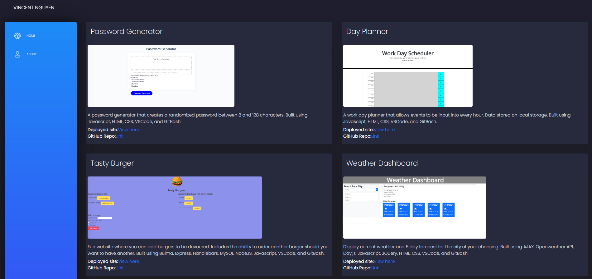

# Vincent-Nguyen-Portfolio

Description
------------

Personal portfolio with links to my projects and LinkedIn built with React.

 Table of contents
---------------
[Tools used](#Tools-used) 
[Deployed here](#Deployed-here) 
[Features](#Features) 
[Credits](#Credits) 
[License](#License)

Tools used
-------------------

* Bootstrap - Has premade layouts and components useful for making a webpage without having to start from scratch. 
* CSS - Style the page with custom colors, and spacing.
* GitBash - Assist with version control via commits, push, and pull to and from GitHub.
* GitHub - Site where the repository lies for deployment and edits.
* HTML - Contains the base of the webpage and allows browsers to interpret the code as a webpage.
* Node.js - Calls in modules necessary for bulma CSS styling.
* React - Frontend javascript library utilized to create the entire portfolio.
* VS Code - Application used to write and edit code for the webpage.

Deployed here
-------------

Below is the link to the deployed webpage.  
[Link to site](https://vincent-nguyen8931.github.io/react-portfolio/)

Features
-------------
React portfolio that displays multiple pages containing information about me. This portfolio utilizes a single project component creates the list of projects based on a json file. 

Credits
---------------
LinkedIn: [https://www.linkedin.com/in/vincent-nguyen8931/](https://www.linkedin.com/in/vincent-nguyen8931/)  
GitHub: [https://github.com/vincent-nguyen8931](https://github.com/vincent-nguyen8931)

License
-------------
- Copyright 2020 Creative Tim (https://www.creative-tim.com)
- Licensed under MIT (https://github.com/creativetimofficial/black-dashboard-react/blob/master/LICENSE.md)

